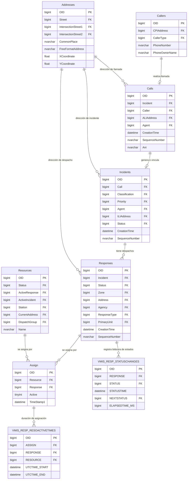

# Análisis de Base de Datos: ViperCAD_Log (Sistema TiburonCad)

Este documento detalla el análisis de la estructura, relaciones, arquitectura de auditoría y guías de reportabilidad para la base de datos **ViperCAD_Log**, la cual forma parte del sistema de despacho asistido por computadora (CAD - Computer Aided Dispatch) TiburonCad.

---

## 1. Información del Servidor y Conexión

*   **Motor de Base de Datos:** Microsoft SQL Server
*   **Servidor:** `192.168.1.122`
*   **Base de Datos:** `ViperCAD_Log`
*   **Usuario:** `cescobar`

> [!NOTE]
> La base de datos no tiene restricciones explícitas de clave foránea (`FOREIGN KEY`) definidas en el catálogo del motor SQL Server. La integridad referencial y las relaciones se controlan a nivel de la lógica de aplicación del sistema CAD utilizando identificadores de tipo `bigint` (referenciados como `OID`).

---

## 2. Estructura y Entidades Core

El sistema de despacho gestiona cinco entidades transaccionales principales: **Llamadas (Calls)**, **Incidentes (Incidents)**, **Despachos/Respuestas (Responses)**, **Recursos (Resources/Units)** y **Asignaciones (Assign)**.



### Descripción de Tablas Principales

1.  **`Calls` (Llamadas):** Registra las llamadas telefónicas entrantes.
    *   `OID` (PK): Identificador único de la llamada.
    *   `Incident` (FK): Apunta a `Incidents.OID` si la llamada generó o se asoció a un incidente.
    *   `Caller` (FK): Relación con `Callers.OID` (detalles del llamante).
    *   `ALIAddress` (FK): Apunta a `Addresses.OID` (dirección asociada al número de teléfono/ALI).
    *   `Agent` (FK): El operador receptor de la llamada (`Agents.OID`).
    *   `CallState` (FK): Estado actual de la telefonía (`CallStates.OID`).
    *   `Origin` (FK): Origen de la llamada (ej. Power911, CAD manual, SIA, etc. - `Origins.OID`).

2.  **`Incidents` (Incidentes / Casos):** Eventos o emergencias creados a partir de las llamadas.
    *   `OID` (PK): Identificador del incidente.
    *   `SequenceNumber`: Número de ticket visible al usuario (ej. correlativo diario/anual).
    *   `Call` (FK): Llamada original (`Calls.OID`).
    *   `Classification` (FK): Tipo de incidente (ej. Robo, Accidente, etc. - `Classifications.OID`).
    *   `Priority` (FK): Nivel de prioridad (`Priorities.OID`).
    *   `ILIAddress` (FK): Ubicación exacta del incidente (`Addresses.OID`).
    *   `Status` (FK): Estado del incidente (`Statuses.OID`).
    *   `PrimaryAgency` (FK): Agencia primaria asignada (`Agencies.OID`).

3.  **`Responses` (Despachos / Respuestas de Incidentes):** Las respuestas operativas o misiones de despacho asociadas a un incidente. Un incidente puede tener múltiples respuestas/despachos (ej. una patrulla de tránsito y una ambulancia).
    *   `OID` (PK): Identificador de la respuesta.
    *   `Incident` (FK): Incidente contenedor (`Incidents.OID`).
    *   `Status` (FK): Estado de la respuesta (ej. Despachado, En Ruta, En Sitio, Terminado, Cerrado).
    *   `Agency` (FK): Agencia que responde (`Agencies.OID`).
    *   `ResponseType` (FK): Tipo específico de despacho (`ResponseTypes.OID`).
    *   `PrimaryUnit` (FK): Recurso/unidad primaria liderando esta respuesta (`Resources.OID`).

4.  **`Resources` (Recursos / Unidades):** Las unidades físicas (vehículos, patrullas, ambulancias) disponibles para despachar.
    *   `OID` (PK): Identificador del recurso.
    *   `Name`: Nombre/código de la unidad (ej. "PR-10", "AMB-02").
    *   `Status` (FK): Estado actual del recurso (ej. Disponible, Despachado, Fuera de Turno - `Statuses.OID`).
    *   `ActiveResponse` (FK): Respuesta en la que está asignado actualmente (`Responses.OID`).
    *   `Station` (FK): Estación base de procedencia (`Stations.OID`).

5.  **`Assign` (Asignación de Unidades):** Relación muchos a muchos que vincula un recurso a una respuesta activa.
    *   `Resource` (FK): `Resources.OID`.
    *   `Response` (FK): `Responses.OID`.
    *   `Active`: Bandera (`1` = asignación activa actual, `0` = histórica).
    *   `TimeStamp1`: Hora de la asignación.

6.  **`Addresses` (Direcciones y Georeferenciación):** Almacena direcciones normalizadas y coordenadas GIS.
    *   `Street` (FK): Calle principal (`Streets.OID`).
    *   `CommonPlace`: Lugar de interés público (ej. "Centro Comercial X").
    *   `FreeFormatAddress`: Dirección en texto libre.
    *   `XCoordinate` / `YCoordinate`: Coordenadas geográficas (Float).

---

## 3. Arquitectura de Historiales y Auditoría (Tablas `_M`)

Una particularidad crítica de **ViperCAD_Log** es que las tablas con sufijo `_M` (ej. `Calls_M`, `Incidents_M`, `Responses_M`, `Resources_M`) no duplican las filas completas de la tabla base en cada modificación.

En su lugar, operan bajo un modelo **EAV (Entity-Attribute-Value) de Auditoría a Nivel de Campo**:
*   **`OID`**: Identifica la fila original en la tabla base.
*   **`Tag`**: Almacena el nombre de la columna que sufrió el cambio (en mayúsculas, ej. `'STATUS'`, `'INCIDENT'`, `'PRIORITY'`).
*   **`Value`**: El nuevo valor que fue guardado en ese campo (como cadena de texto).
*   **`Time`**: Fecha y hora exacta de la modificación.
*   **`UserId`**: `Agents.OID` del operador que realizó la modificación.
*   **`WorkstationID`**: `WorkStations.OID` donde se procesó la transacción.
*   **`T_Id` (Transaction ID)**: Agrupa múltiples cambios de campos que ocurrieron simultáneamente en una sola acción del usuario (ej. crear la llamada escribe varios campos con el mismo `T_Id`).

> [!TIP]
> Para conocer el valor de un campo en un punto específico del pasado, se debe buscar en la tabla `_M` correspondiente el registro con la fecha (`Time`) máxima que sea menor o igual a la fecha deseada para ese `OID` y `Tag` específicos.

---

## 4. Tablas Especializadas de Reportabilidad (`VMIS_`)

La base de datos provee tablas prefijadas con `VMIS_` diseñadas especialmente para la recopilación de estadísticas y cálculo de tiempos de respuesta sin sobrecargar las tablas históricas transaccionales:

### A. `VMIS_RESP_STATUSCHANGES` (17.6 Millones de filas)
Registra cada cambio de estado de una respuesta (despacho) con su respectiva duración.
*   `RESPONSE` (FK): `Responses.OID`.
*   `STATUS` (FK): Estado de partida (`Statuses.OID`).
*   `STATUSTIME`: Hora del cambio de estado.
*   `NEXTSTATUS` (FK): Estado destino (`Statuses.OID`).
*   `ELAPSEDTIME_MS`: Tiempo transcurrido en el estado actual en **milisegundos**.

> [!IMPORTANT]
> **Regla de Desbordamiento:** Si una transición está abierta (ej. el estado final aún no ha ocurrido) o se registra un cierre forzado, `ELAPSEDTIME_MS` tomará el valor por defecto `2147483647` (que corresponde a `Int32.MaxValue`). Al hacer reportes de promedios de tiempo, **siempre se deben filtrar estos valores**.

### B. `VMIS_RESP_RESOACTIVETIMES` (2.4 Millones de filas)
Calcula el tiempo activo de cada recurso asignado a un despacho.
*   `ASSIGN` (FK): `Assign.OID`.
*   `RESPONSE` (FK): `Responses.OID`.
*   `RESOURCE` (FK): `Resources.OID`.
*   `UTCTIME_START` / `UTCTIME_END`: Periodo de tiempo de actividad en UTC. Permite medir la utilización de unidades.

---

## 5. Catálogo de Tablas de Búsqueda (Lookups)

Para armar reportes coherentes, se deben mapear los OIDs utilizando las siguientes tablas catalogadas activas (`Deleted = 0` o `NULL`):

### Tabla: `Statuses` (Estados de Despacho y Recursos)

Los estados se clasifican mediante `StatusType` (1 = Respuestas/Casos, 2 = Recursos/Unidades):

| OID | Nombre (Name) | ShortName | StatusType | ActionType | Descripción Operativa |
| :--- | :--- | :--- | :--- | :--- | :--- |
| **1** | Req_Despacho | Req_D | 1 | 1 | Llamada/Caso requiere despacho |
| **2** | Despachado | Desp | 1 | 2 | Unidad despachada al sitio |
| **3** | En Ruta | Enrou | 1 | 3 | Unidad desplazándose en camino |
| **4** | En Sitio | En Si | 1 | 3 | Unidad arribó al lugar del incidente |
| **5** | Apilada | Apilad | 1 | 1 | Caso en cola de espera (Stacked) |
| **6** | Terminado | Termi | 1 | 5 | Incidente/Unidad terminó su labor |
| **7** | Cerrado | Cerr | 1 | 6 | Caso cerrado administrativamente |
| **8** | Disponible | Dispon | 2 | 11 | Unidad libre y operativa |
| **9** | Abandono | Aband | 2 | 11 | Unidad fuera de servicio / Logged out |
| **10** | Fuera De Turno | FDT | 2 | 11 | Unidad fuera de horario |

### Tabla: `Priorities` (Prioridades de Emergencias)

| OID | Nombre | Rank |
| :--- | :--- | :--- |
| **2116136807715307523** | Normal | 1 |
| **2116136872139816963** | SEM (Emergencia Médica) | 2 |
| **2159929337942376453** | 0 | 3 |

### Tabla: `CallStates` (Estados Telefónicos)

| OID | Nombre | CallOrder | Descripción |
| :--- | :--- | :--- | :--- |
| **10** | Ringing | 0 | Llamada timbrando |
| **20** | Abandoned | | Colgada antes de contestar |
| **30** | Busy | 1 | Línea ocupada |
| **40** | Talk | 2 | En conversación con operador |
| **60** | Hold | 3 | Llamada retenida |
| **80** | Released | 6 | Llamada colgada / liberada |
| **120** | Parked | 5 | Llamada transferida a parqueo |

### Tabla: `Agencies` (Agencias del Sistema)

| OID | Nombre de Agencia (Name) |
| :--- | :--- |
| **1636348532224950273** | PRUEBA-CAPACITACION |
| **1657078909138632716** | SERVICIOS DE EMERGENCIA |
| **1659292750031355916** | INVESTIGACIONES |
| **1659292986254557196** | TRANSITO TERRESTRE |
| **1671880904038940676** | CONTROL MIGRATORIO Y FISCAL |

### Tabla: `Origins` (Orígenes de Entrada de Incidente)

| OID | Name | Description |
| :--- | :--- | :--- |
| **1** | P911 | Integrado automáticamente desde telefonía Power911 |
| **2** | CAD | Digitado manualmente por un operador CAD |
| **3** | Quick Call | Iniciado en el momento (Self-Initiated) |
| **4** | MVS | Parada de Vehículo Motorizado (Motor Vehicle Stop) |
| **5 - 8** | * (Deferred) | Equivalentes a los anteriores, pero en modo diferido |

---

## 6. Plantillas SQL para la Creación de Reportes

A continuación, se proveen los queries de SQL Server optimizados para generar los reportes gerenciales y operativos más solicitados:

### A. Reporte de Tiempos de Respuesta Promedio (Response Times)

Este reporte calcula el promedio de tiempos de reacción (en segundos) por **Agencia**, **Prioridad** y **Tipo de Incidente**. Se apoya en `VMIS_RESP_STATUSCHANGES` y filtra el valor de desbordamiento.

```sql
SELECT 
    ag.Name AS Agencia,
    pr.Name AS Prioridad,
    rt.Name AS TipoIncidente,
    COUNT(DISTINCT r.OID) AS TotalDespachos,
    
    -- 1. Tiempo de Despacho (Desde solicitud de despacho hasta unidad despachada)
    ROUND(AVG(CASE WHEN sc.STATUS = 1 AND sc.NEXTSTATUS = 2 AND sc.ELAPSEDTIME_MS != 2147483647 THEN sc.ELAPSEDTIME_MS / 1000.0 ELSE NULL END), 2) AS PromedioDespacho_Seg,
    
    -- 2. Tiempo de Preparación / En Ruta (Desde despachado hasta que se pone en ruta)
    ROUND(AVG(CASE WHEN sc.STATUS = 2 AND sc.NEXTSTATUS = 3 AND sc.ELAPSEDTIME_MS != 2147483647 THEN sc.ELAPSEDTIME_MS / 1000.0 ELSE NULL END), 2) AS PromedioEnRuta_Seg,
    
    -- 3. Tiempo de Viaje / Tránsito (Desde en ruta hasta llegada a sitio)
    ROUND(AVG(CASE WHEN sc.STATUS = 3 AND sc.NEXTSTATUS = 4 AND sc.ELAPSEDTIME_MS != 2147483647 THEN sc.ELAPSEDTIME_MS / 1000.0 ELSE NULL END), 2) AS PromedioTransito_Seg,
    
    -- 4. Tiempo en Escena (Desde llegada a sitio hasta finalización de labores)
    ROUND(AVG(CASE WHEN sc.STATUS = 4 AND sc.NEXTSTATUS = 6 AND sc.ELAPSEDTIME_MS != 2147483647 THEN sc.ELAPSEDTIME_MS / 1000.0 ELSE NULL END), 2) AS PromedioEnSitio_Seg
FROM VMIS_RESP_STATUSCHANGES sc
INNER JOIN Responses r ON sc.RESPONSE = r.OID
LEFT JOIN Agencies ag ON r.Agency = ag.OID
LEFT JOIN Priorities pr ON r.Priority = pr.OID
LEFT JOIN ResponseTypes rt ON r.ResponseType = rt.OID
WHERE sc.STATUSTIME >= '2026-01-01 00:00:00' -- Rango de fechas parametrizable
GROUP BY ag.Name, pr.Name, rt.Name
ORDER BY Agencia, PromedioDespacho_Seg DESC;
```

### B. Reporte de Volumen de Incidentes por Clasificación y Prioridad

Para evaluar qué tipos de emergencias son las más comunes y su volumen por fecha.

```sql
SELECT 
    CAST(i.CreationTime AS DATE) AS Fecha,
    cl.Name AS ClasificacionIncidente,
    pr.Name AS Prioridad,
    COUNT(i.OID) AS CantidadIncidentes,
    SUM(CASE WHEN i.Finalized = 1 THEN 1 ELSE 0 END) AS Finalizados,
    SUM(CASE WHEN i.Deleted = 1 THEN 1 ELSE 0 END) AS Eliminados
FROM Incidents i
LEFT JOIN Classifications cl ON i.Classification = cl.OID
LEFT JOIN Priorities pr ON i.Priority = pr.OID
WHERE i.CreationTime >= '2026-08-01 00:00:00'
  AND (i.Deleted = 0 OR i.Deleted IS NULL)
GROUP BY CAST(i.CreationTime AS DATE), cl.Name, pr.Name
ORDER BY Fecha DESC, CantidadIncidentes DESC;
```

### C. Reporte de Utilización y Eficiencia de Unidades (Recursos)

Mide cuántas veces se despachó una unidad y cuántas horas totales estuvo en servicio activo (en tránsito o escena).

```sql
SELECT 
    res.Name AS CodigoUnidad,
    sta.Name AS EstacionBase,
    COUNT(rat.RESPONSE) AS TotalDespachos,
    
    -- Horas totales en servicio activo
    ROUND(SUM(DATEDIFF(second, rat.UTCTIME_START, rat.UTCTIME_END)) / 3600.0, 2) AS HorasServicioActivo,
    
    -- Promedio de horas por despacho
    ROUND(AVG(DATEDIFF(second, rat.UTCTIME_START, rat.UTCTIME_END)) / 60.0, 2) AS PromedioMinutosPorDespacho
FROM VMIS_RESP_RESOACTIVETIMES rat
INNER JOIN Resources res ON rat.RESOURCE = res.OID
LEFT JOIN Stations sta ON res.Station = sta.OID
WHERE rat.UTCTIME_START >= '2026-08-01 00:00:00'
GROUP BY res.Name, sta.Name
ORDER BY HorasServicioActivo DESC;
```

### D. Reporte de Códigos de Cierre / Disposiciones de Emergencias

Permite listar el destino o resultado final de las respuestas atendidas por las unidades (ej. "EMERGENCIA ATENDIDA", "FALSA ALARMA", "DUPLICADO").

```sql
SELECT 
    ag.Name AS Agencia,
    rt.Name AS TipoRespuesta,
    dc.Name AS CodigoCierre,
    COUNT(r.OID) AS Cantidad
FROM Responses r
LEFT JOIN Agencies ag ON r.Agency = ag.OID
LEFT JOIN ResponseTypes rt ON r.ResponseType = rt.OID
INNER JOIN FinalizedResponsesDispCodes frd ON r.OID = frd.Response 
                                            AND (frd.Deleted = 0 OR frd.Deleted IS NULL)
INNER JOIN DispositionCodes dc ON frd.DispositionCode = dc.OID
WHERE r.CreationTime >= '2026-08-01 00:00:00'
GROUP BY ag.Name, rt.Name, dc.Name
ORDER BY Agencia, Cantidad DESC;
```

### E. Desempeño y Carga de Trabajo de Telefonistas / Operadores

Mide la cantidad de llamadas que atendió cada operador telefónico y el promedio de duración de llamada.

```sql
SELECT 
    COALESCE(a.DisplayName, a.LogonName) AS NombreOperador,
    a.BadgeNumber AS Placa,
    COUNT(c.OID) AS LlamadasAtendidas,
    
    -- Llamadas caídas/abandonadas asociadas al operador
    SUM(CASE WHEN c.CallState = 20 THEN 1 ELSE 0 END) AS LlamadasAbandonadas,
    
    -- Origen de las llamadas que procesó
    SUM(CASE WHEN c.Origin = 1 THEN 1 ELSE 0 END) AS Recibidas_Power911,
    SUM(CASE WHEN c.Origin = 2 THEN 1 ELSE 0 END) AS Creadas_CAD_Manual
FROM Calls c
INNER JOIN Agents a ON c.Agent = a.OID
WHERE c.CreationTime >= '2026-08-01 00:00:00'
  AND (c.Deleted = 0 OR c.Deleted IS NULL)
GROUP BY COALESCE(a.DisplayName, a.LogonName), a.BadgeNumber
ORDER BY LlamadasAtendidas DESC;
```
